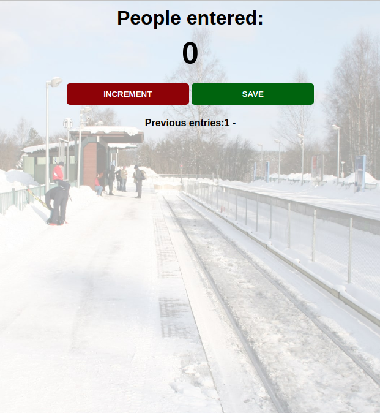

# Scrimba Passenger Counter WebApp

> Learning JS with Scrimba Passenger Counter WebApp.
> 

In the learning of JavaScript I have followed the tuturial of Scrimba CEO and as result I have created webapp that helps count the passengers visiting a stations.

## Built With

- HTML & CSS with JavaScript
- None
- VS Code

## Live Demo

[Live Demo Link](https://raovikrant82.github.io/Scrimba-Passenger_counter/)

## Authors

👤 **Author**

- GitHub: [@raovikrant82](https://github.com/raovikrant82)
- Twitter: [@Imvikrantrao](https://twitter.com/Imvikrantrao)

## 🤝 Contributing

Contributions, issues, and feature requests are welcome!

Feel free to check the [issues page](../../issues/).

## Show your support

Give a ⭐️ if you like this project!

## Acknowledgments

- Hat tip to Scrimba for such a wonderful tutorial
- Inspiration
- etc

## 📝 License

This project is [MIT](./MIT.md) licensed.
